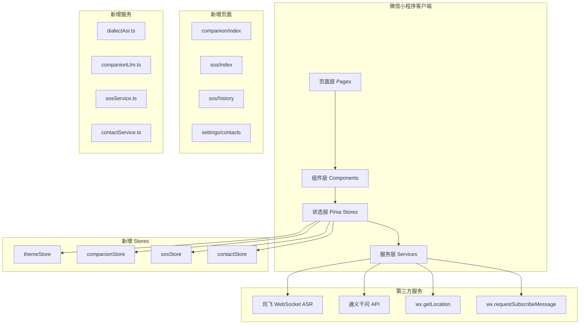
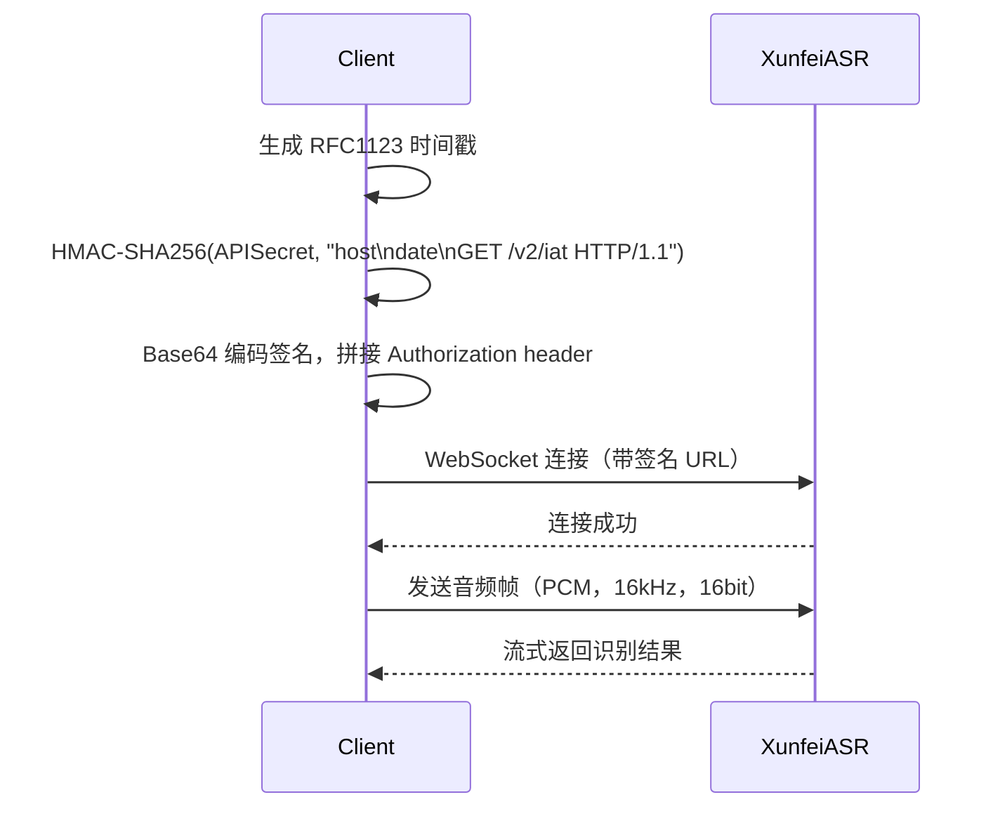
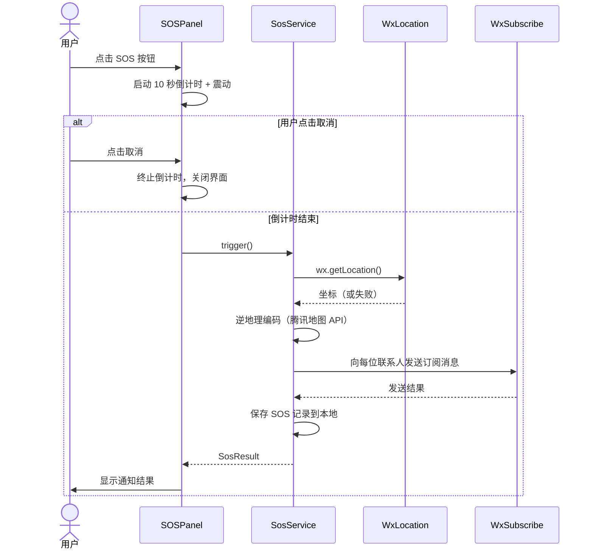
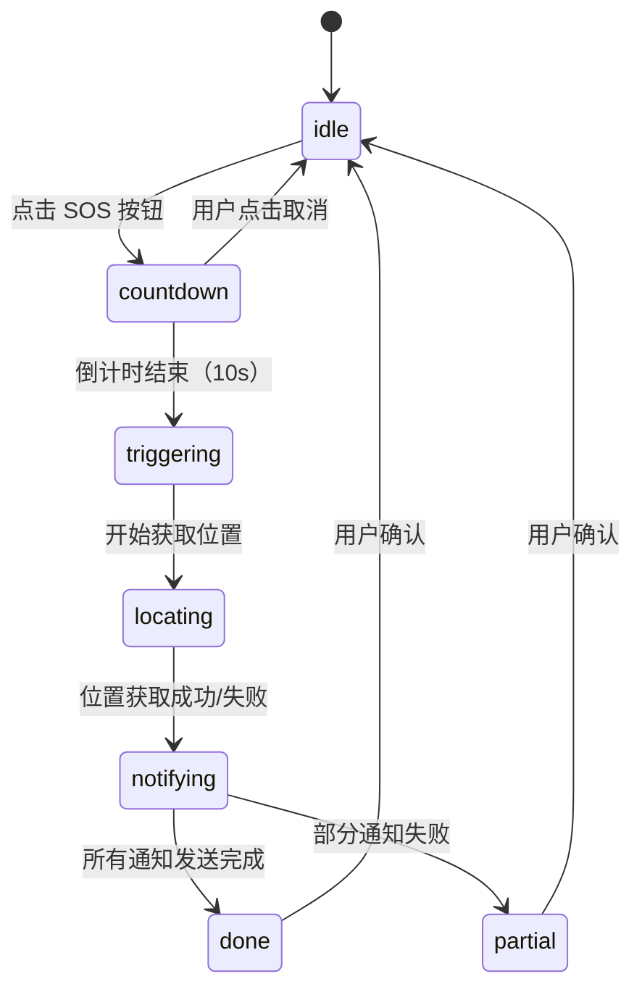

# 技术设计文档：银龄 AI 助手小程序 v2

## 概述

银龄 AI 助手小程序 v2 在现有 uni-app + Vue3 + TypeScript + Pinia 基础上，新增四项功能：**方言识别**、**UI 主题切换**、**AI 情感陪伴聊天**、**紧急救助系统**。

### 设计原则（继承 v1）

- **语音优先**：所有核心操作均可通过语音完成
- **适老化**：88×88pt 最小触摸区域、18pt 正文字体、高对比度配色
- **离线降级**：网络不可用时提供本地缓存兜底
- **平台约束优先**：严格遵守微信小程序限制（无 DOM、包体积 ≤2MB 主包）

### 新增技术选型

| 功能 | 技术选型 |
|------|---------|
| 方言识别 | 讯飞 WebSocket ASR（APPID=c5dbb417），降级到微信同声传译插件 |
| 主题切换 | CSS 变量（`--theme-*`）+ `wx.setStorageSync` |
| 情感陪伴 | 通义千问 API（qwen-turbo），专属系统提示词 |
| 紧急救助 | `wx.getLocation` + 微信订阅消息通知 |

---

## 架构

### 整体架构图（v2 扩展）



### 页面路由结构（v2 新增）

```
pages/
├── index/index              # 首页（新增 AI 陪伴、紧急救助卡片）
├── companion/index          # AI 情感陪伴聊天页（新增）
├── sos/index                # 紧急救助 SOS 页（新增）
├── sos/history              # SOS 历史记录页（新增）
└── settings/
    └── contacts             # 紧急联系人管理页（新增）
```

### 分层职责（v2 新增部分）

```
src/
├── pages/
│   ├── companion/index.vue  # 陪伴聊天页
│   ├── sos/index.vue        # SOS 触发页
│   ├── sos/history.vue      # SOS 历史页
│   └── settings/contacts.vue # 联系人管理页
├── stores/
│   ├── themeStore.ts        # 主题状态
│   ├── companionStore.ts    # 陪伴聊天状态
│   ├── sosStore.ts          # SOS 状态
│   └── contactStore.ts      # 联系人状态
├── services/
│   ├── dialectAsr.ts        # 讯飞方言 ASR
│   ├── companionLlm.ts      # 情感陪伴 LLM
│   ├── sosService.ts        # SOS 流程服务
│   └── contactService.ts   # 联系人 CRUD
└── types/
    └── index.ts             # 扩展类型定义
```

---

## 组件与接口

### 方言识别服务接口

讯飞 ASR 通过 WebSocket 连接，鉴权采用 HMAC-SHA256 签名。

```typescript
// services/dialectAsr.ts
type DialectMode = 'mandarin' | 'cantonese' | 'hokkien' | 'sichuan'

interface DialectAsrService {
  startRecording(mode: DialectMode): void
  stopRecording(): Promise<AsrResult>
  readonly currentMode: DialectMode
}

// 讯飞 ASR 方言语言代码映射
const DIALECT_LANG_MAP: Record<DialectMode, string> = {
  mandarin: 'zh_cn',
  cantonese: 'zh_yue',   // 粤语
  hokkien: 'zh_min',     // 闽南语
  sichuan: 'zh_sc',      // 四川话
}
```

鉴权流程（WebSocket URL 签名）：



### 主题服务接口

```typescript
// stores/themeStore.ts
type ThemeId = 'nature' | 'traditional' | 'modern' | 'ink'

interface ThemeConfig {
  id: ThemeId
  name: string
  vars: {
    '--theme-primary': string
    '--theme-bg': string
    '--theme-text': string
    '--theme-card': string
    '--theme-accent': string
  }
}

interface ThemeStore {
  currentTheme: ThemeId
  // actions
  applyTheme(id: ThemeId): void   // 写入 CSS 变量 + 持久化
  loadTheme(): void               // 启动时从 storage 恢复
}
```

CSS 变量注入方式（uni-app 中通过 `page` 选择器）：

```scss
// uni.scss 全局变量声明
page {
  --theme-primary: #5D4037;
  --theme-bg: #EFEBE9;
  --theme-text: #1a1a1a;
  --theme-card: #fff9f0;
  --theme-accent: #795548;
}
```

运行时通过 `uni.createSelectorQuery` 或直接操作 `document.documentElement.style`（H5）/ `wx.setStorageSync` + 页面 `onShow` 重新读取（小程序）实现动态切换。

### 情感陪伴 LLM 服务接口

```typescript
// services/companionLlm.ts
interface CompanionLlmService {
  chat(messages: CompanionMessage[], userProfile?: UserProfile): Promise<string>
  generateGreeting(timeOfDay: 'morning' | 'afternoon' | 'evening'): Promise<string>
  detectNegativeEmotion(text: string): boolean  // 本地关键词检测，无需 API
}

interface CompanionMessage {
  id: string
  role: 'user' | 'assistant'
  content: string
  timestamp: number
}

interface UserProfile {
  preferredTopics: string[]  // 用户常聊话题，用于个性化问候
}
```

银龄人格系统提示词：

```
你是"银龄"，一位耐心、温暖、懂得倾听的老年关怀助手。
你的说话风格：
- 语气亲切，像邻居家的晚辈
- 主动关心用户的日常状态
- 回复简短（不超过200字），避免生硬的功能性语言
- 遇到用户表达孤独、难过时，给予情感支持，并建议联系家人
- 遇到用户描述身体严重不适时，建议就医并提示可使用紧急救助功能
当前时间段：{timeOfDay}
```

### SOS 服务接口

```typescript
// services/sosService.ts
interface SosService {
  trigger(): Promise<SosResult>           // 触发完整 SOS 流程
  getLocation(): Promise<LocationInfo>    // wx.getLocation 封装
  notifyContacts(contacts: Contact[], location: LocationInfo): Promise<NotifyResult[]>
  saveRecord(record: SosRecord): void
}

interface LocationInfo {
  latitude: number
  longitude: number
  address: string   // 逆地理编码结果（省市区街道）
  success: boolean
}

interface SosRecord {
  id: string
  triggeredAt: number
  location: LocationInfo
  notifyResults: NotifyResult[]
  status: 'success' | 'partial' | 'failed'
}

interface NotifyResult {
  contactId: string
  contactName: string
  success: boolean
  failReason?: string
}
```

SOS 触发流程：



### 联系人服务接口

```typescript
// services/contactService.ts
interface ContactService {
  list(): Contact[]
  add(contact: CreateContactDto): Contact
  update(id: string, dto: Partial<CreateContactDto>): Contact
  remove(id: string): void
  validate(phone: string): boolean  // 11位数字且以1开头
}

interface Contact {
  id: string
  name: string
  phone: string
  relation: string   // 如"儿子"、"女儿"
  createdAt: number
}

type CreateContactDto = Omit<Contact, 'id' | 'createdAt'>
```

---

## 数据模型

### 新增类型定义

```typescript
// types/index.ts 扩展

// 方言模式
type DialectMode = 'mandarin' | 'cantonese' | 'hokkien' | 'sichuan'

// 主题
type ThemeId = 'nature' | 'traditional' | 'modern' | 'ink'

interface ThemeConfig {
  id: ThemeId
  name: string
  vars: Record<string, string>
}

// 情感陪伴消息（扩展 ChatMessage）
interface CompanionMessage {
  id: string
  role: 'user' | 'assistant'
  content: string
  timestamp: number
}

// 紧急联系人
interface Contact {
  id: string
  name: string
  phone: string
  relation: string
  createdAt: number
}

// SOS 记录
interface SosRecord {
  id: string
  triggeredAt: number
  location: LocationInfo
  notifyResults: NotifyResult[]
  status: 'success' | 'partial' | 'failed'
}

interface LocationInfo {
  latitude: number
  longitude: number
  address: string
  success: boolean
}

interface NotifyResult {
  contactId: string
  contactName: string
  success: boolean
  failReason?: string
}

// 扩展 AppSettings
interface AppSettings {
  autoSpeak: boolean
  ttsSpeed: number
  fontSize: 'normal' | 'large' | 'xlarge'
  dialectMode: DialectMode          // 新增
  companionAutoTts: boolean         // 新增：陪伴聊天自动朗读
  theme: ThemeId                    // 新增
}
```

### 四种主题色彩规范

| 主题 | `--theme-primary` | `--theme-bg` | `--theme-text` | `--theme-card` | `--theme-accent` |
|------|-------------------|--------------|----------------|----------------|------------------|
| 自然草本风 (nature) | #4CAF50 | #F1F8E9 | #1B5E20 | #FFFFFF | #8BC34A |
| 中华传统风 (traditional) | #C0392B | #F7F3EB | #1a1a1a | #fff9f0 | #E74C3C |
| 现代简约风 (modern) | #2196F3 | #FAFAFA | #212121 | #FFFFFF | #03A9F4 |
| 水墨养生风 (ink) | #5D4037 | #EFEBE9 | #1a1a1a | #fff9f0 | #795548 |

### 本地存储 Key 规范（v2 新增）

| Key | 类型 | 说明 |
|-----|------|------|
| `silver_theme` | `ThemeId` | 当前主题标识 |
| `silver_dialect_mode` | `DialectMode` | 用户方言偏好 |
| `silver_companion_history` | `CompanionMessage[]` | 陪伴聊天记录（最近 50 条） |
| `silver_companion_profile` | `UserProfile` | 用户聊天偏好 |
| `silver_contacts` | `Contact[]` | 紧急联系人列表（最多 5 位） |
| `silver_sos_records` | `SosRecord[]` | SOS 历史记录（最近 90 天） |

### 首页新增功能卡片

首页 `pages/index/index.vue` 在现有三张卡片后新增两张：

```
AI 陪伴卡片：
  图标：💬
  标题：AI 陪伴
  描述：聊聊天，说说心里话
  路由：/pages/companion/index

紧急救助卡片：
  图标：🆘
  标题：紧急救助
  描述：一键求救，守护安全
  路由：/pages/sos/index
  样式：红色强调边框，视觉突出
```

首页右上角新增常驻 SOS 快捷按钮（红色圆形，88×88pt，固定定位）。

### pages.json 新增路由

```json
{
  "path": "pages/companion/index",
  "style": { "navigationBarTitleText": "AI 陪伴" }
},
{
  "path": "pages/sos/index",
  "style": { "navigationBarTitleText": "紧急救助", "navigationBarBackgroundColor": "#C0392B" }
},
{
  "path": "pages/sos/history",
  "style": { "navigationBarTitleText": "求救记录" }
},
{
  "path": "pages/settings/contacts",
  "style": { "navigationBarTitleText": "紧急联系人" }
}
```

---

## 正确性属性

*属性（Property）是在系统所有有效执行中都应成立的特征或行为——本质上是对系统应做什么的形式化陈述。属性是人类可读规范与机器可验证正确性保证之间的桥梁。*

### 属性 1：方言模式正确传递给 ASR 服务

*对于任意*方言模式（普通话、粤语、闽南语、四川话），当用户选择该模式并触发录音时，`dialectAsrService` 被调用时传入的语言代码应与 `DIALECT_LANG_MAP` 中该模式对应的值完全一致。

**验证需求：1.2、2.4**

---

### 属性 2：方言语言偏好持久化 Round Trip

*对于任意*合法的方言模式值，调用 `setDialectMode(mode)` 后，从本地存储读取 `silver_dialect_mode` 应得到相同的模式值；小程序重启后 `dialectMode` 状态应恢复为该值。

**验证需求：1.5**

---

### 属性 3：低置信度识别结果触发错误提示且不调用 LLM

*对于任意* ASR 识别结果，若 `confidence < 0.5` 或 `text` 为空字符串（含纯空白），系统应显示"没有听清，请再说一遍"提示，且 `Companion_LLM_Service` 和 `LLM_Service` 均不应被调用。

**验证需求：1.6、2.5**

---

### 属性 4：方言服务失败时自动降级到普通话 ASR

*对于任意*讯飞 ASR 服务调用失败或超时的场景，系统应自动切换到 `asrService`（普通话识别），且向用户显示"方言识别暂不可用，已切换为普通话识别"提示。

**验证需求：1.7、1.9**

---

### 属性 5：方言识别结果以普通话文字传入 LLM

*对于任意*方言识别成功的结果（`success=true`，`confidence ≥ 0.5`，`text` 非空），传入 `LLM_Service.chat()` 或 `Companion_LLM_Service.chat()` 的消息内容应为普通话文字字符串，而非音频路径或原始方言编码。

**验证需求：2.3、5.4**

---

### 属性 6：主题配置包含五个完整 CSS 变量

*对于任意*主题 ID（nature、traditional、modern、ink），其 `ThemeConfig.vars` 对象应包含且仅包含 `--theme-primary`、`--theme-bg`、`--theme-text`、`--theme-card`、`--theme-accent` 五个键，且每个值均为非空字符串。

**验证需求：3.6、4.6**

---

### 属性 7：主题色值与规范完全匹配

*对于任意*主题 ID，其 `ThemeConfig.vars` 中各 CSS 变量的值应与设计规范中预定义的色值完全一致（如 nature 主题的 `--theme-primary` 应为 `#4CAF50`）。

**验证需求：4.1、4.2、4.3、4.4**

---

### 属性 8：主题选择持久化 Round Trip

*对于任意*合法的主题 ID，调用 `themeStore.applyTheme(id)` 后，从本地存储读取 `silver_theme` 应得到相同的主题 ID；小程序重启后 `currentTheme` 状态应恢复为该值。

**验证需求：3.4**

---

### 属性 9：陪伴聊天回复字数不超过 200 字

*对于任意*用户发送的消息内容，`Companion_LLM_Service.chat()` 返回的回复字符串长度应不超过 200 个字符。

**验证需求：5.3**

---

### 属性 10：陪伴聊天历史记录上限为 50 条

*对于任意*数量的消息发送操作（包括超过 50 条的情况），`companionStore.messages` 数组长度应始终不超过 50，超出时移除最旧的记录。

**验证需求：5.7**

---

### 属性 11：陪伴聊天 TTS 调用受设置控制

*对于任意* AI 回复内容，当 `AppSettings.companionAutoTts=true` 时，`TTS_Service.speak()` 应被以 `speed=0.8` 调用一次；当 `companionAutoTts=false` 时，`TTS_Service.speak()` 不应被自动调用。

**验证需求：5.8**

---

### 属性 12：陪伴聊天系统提示词包含"银龄"人格标识

*对于任意*对话请求，`Companion_LLM_Service` 调用通义千问 API 时，`messages` 数组中的第一条 `system` 消息内容应包含"银龄"关键词。

**验证需求：6.1**

---

### 属性 13：话题引导按钮点击触发对应用户消息

*对于任意*话题引导按钮（"聊聊今天"、"讲个故事"、"健康小知识"、"想念家人"），点击后 `companionStore.messages` 中应新增一条 `role='user'`、`content` 等于该话题文本的消息。

**验证需求：6.3**

---

### 属性 14：SOS 取消操作不触发通知

*对于任意*倒计时阶段（1 秒到 9 秒）的取消操作，`SOS_Service.trigger()` 不应被调用，`sosStore.records` 不应新增记录，且不应向任何联系人发送通知。

**验证需求：7.6**

---

### 属性 15：SOS 触发时调用位置 API 并通知所有联系人

*对于任意*非空的紧急联系人列表，当 SOS 流程完整触发（倒计时结束且未取消）时，`wx.getLocation` 应被调用一次，且列表中每位联系人都应收到一次通知请求（`notifyResults` 长度等于联系人列表长度）。

**验证需求：8.1、8.3、8.7**

---

### 属性 16：位置获取失败时 SOS 通知仍然发送

*对于任意* `wx.getLocation` 调用失败的场景，`SOS_Service` 应继续向所有联系人发送通知，且通知内容中应包含"位置获取失败"字样。

**验证需求：8.5**

---

### 属性 17：手机号码验证规则

*对于任意*字符串输入，`contactService.validate(phone)` 应当且仅当该字符串满足"长度为 11、全为数字字符、首字符为 '1'"三个条件时返回 `true`，否则返回 `false`。

**验证需求：9.3、9.4**

---

### 属性 18：联系人数量上限为 5 位

*对于任意*添加联系人操作序列，`contactService.list()` 返回的数组长度应始终不超过 5；当已有 5 位联系人时，继续添加应抛出错误或被拒绝。

**验证需求：9.1**

---

### 属性 19：联系人数据持久化 Round Trip

*对于任意*合法的联系人数据（姓名非空、手机号合法、关系非空），调用 `contactService.add(dto)` 后，`contactService.list()` 应包含一条与 `dto` 字段（name、phone、relation）完全一致的记录。

**验证需求：9.5**

---

### 属性 20：SOS 历史记录持久化 Round Trip 且包含完整字段

*对于任意* SOS 触发事件，触发完成后 `sosStore.records` 中应包含一条记录，该记录的 `triggeredAt`（时间戳）、`location`（位置信息）、`notifyResults`（通知结果列表）、`status` 字段均应非空且与实际触发数据一致。

**验证需求：10.1、10.5**

---

### 属性 21：SOS 历史记录按时间倒序且最多展示 20 条

*对于任意* SOS 历史记录列表，展示时应满足：（1）按 `triggeredAt` 降序排列；（2）展示条数不超过 20 条。

**验证需求：10.2**

---

### 属性 22：SOS 历史记录自动清除 90 天前数据

*对于任意* SOS 历史记录列表，调用清理函数后，`sosStore.records` 中不应包含任何 `triggeredAt` 早于当前时间 90 天前的记录。

**验证需求：10.3**

---

## 错误处理

### 错误分类与处理策略（v2 新增）

| 错误类型 | 触发场景 | 处理策略 | 用户提示 |
|---------|---------|---------|---------|
| 方言 ASR 置信度低 | confidence < 0.5 或文字为空 | 不调用 LLM，允许重试 | "没有听清，请再说一遍" |
| 方言 ASR 超时（>8s） | 讯飞服务异常 | 自动降级到普通话 ASR | "方言识别暂不可用，已切换为普通话识别" |
| 讯飞 ASR 不可用 | 插件未启用且 API 失败 | 降级到微信内置 ASR | "方言识别暂不可用，已切换为普通话识别" |
| 主题存储读取失败 | storage 损坏 | 使用默认主题（ink） | 无提示，静默降级 |
| 陪伴 LLM 超时（>10s） | 服务繁忙 | 显示等待提示，继续等待 | "AI 正在思考中..." |
| 陪伴 LLM 调用失败 | 网络异常 | 显示错误提示 | "网络不稳定，请稍后再试" |
| 位置权限被拒绝 | 用户拒绝授权 | 继续 SOS 流程，通知中注明 | "位置获取失败"（附在通知内容中） |
| SOS 通知发送失败 | 网络异常 | 显示联系人电话号码 | "通知发送失败，请拨打 120 或直接联系家人" |
| 联系人列表为空 | 未设置联系人 | 跳转联系人设置页 | "尚未设置紧急联系人，请先前往设置页面添加" |
| 手机号格式错误 | 用户输入非法号码 | 阻止保存，高亮输入框 | "请输入正确的手机号码" |
| 联系人超出上限 | 已有 5 位联系人 | 阻止添加 | "最多添加 5 位紧急联系人" |

### SOS 状态机



---

## 测试策略

### 双轨测试方法

本项目采用**单元测试 + 属性测试**双轨策略：

- **单元测试**：验证具体示例、边缘情况、错误条件
- **属性测试**：验证对所有输入都成立的普遍属性（最少 100 次迭代）

### 测试工具选型

| 工具 | 用途 |
|------|------|
| Vitest | 单元测试运行器 |
| fast-check | 属性测试库（TypeScript 原生支持） |
| @vue/test-utils | Vue 组件测试 |
| vi.mock | 微信 API / 第三方服务 Mock |

### 属性测试配置

每个属性测试最少运行 **100 次**随机输入迭代。每个属性测试必须通过注释标注对应的设计文档属性：

```typescript
// Feature: silver-miniprogram-v2, Property 17: 手机号码验证规则
it('手机号码验证：11位数字且以1开头', () => {
  fc.assert(
    fc.property(fc.string(), (phone) => {
      const result = contactService.validate(phone)
      const expected = /^1\d{10}$/.test(phone)
      expect(result).toBe(expected)
    }),
    { numRuns: 100 }
  )
})
```

### 属性测试覆盖矩阵

| 属性编号 | 属性名称 | 测试类型 | 生成器策略 |
|---------|---------|---------|-----------|
| 属性 1 | 方言模式正确传递给 ASR | property | `fc.constantFrom('mandarin','cantonese','hokkien','sichuan')` |
| 属性 2 | 方言语言偏好持久化 Round Trip | property | `fc.constantFrom(...)` 方言模式 |
| 属性 3 | 低置信度不调用 LLM | property | `fc.float({max: 0.49})` + 随机文字 |
| 属性 4 | 方言服务失败时降级 | property | 模拟讯飞 ASR 抛出错误 |
| 属性 5 | 方言结果以普通话传入 LLM | property | 随机 ASR 成功结果 |
| 属性 6 | 主题配置包含五个 CSS 变量 | property | `fc.constantFrom(...)` 主题 ID |
| 属性 7 | 主题色值与规范匹配 | property | `fc.constantFrom(...)` 主题 ID |
| 属性 8 | 主题选择持久化 Round Trip | property | `fc.constantFrom(...)` 主题 ID |
| 属性 9 | 陪伴回复字数不超过 200 | property | `fc.string({minLength: 1})` 用户消息 |
| 属性 10 | 陪伴历史记录上限 50 条 | property | `fc.integer({min: 1, max: 100})` 消息数量 |
| 属性 11 | 陪伴 TTS 受设置控制 | property | `fc.boolean()` autoTts + 随机回复文字 |
| 属性 12 | 系统提示词包含"银龄" | property | 随机对话消息列表 |
| 属性 13 | 话题按钮触发用户消息 | property | `fc.constantFrom(...)` 四个话题 |
| 属性 14 | SOS 取消不触发通知 | property | `fc.integer({min: 1, max: 9})` 取消时刻 |
| 属性 15 | SOS 触发通知所有联系人 | property | `fc.array(contactArb, {minLength: 1, maxLength: 5})` |
| 属性 16 | 位置失败时通知仍发送 | property | 模拟 wx.getLocation 失败 |
| 属性 17 | 手机号码验证规则 | property | `fc.string()` 任意字符串 |
| 属性 18 | 联系人数量上限 5 位 | property | `fc.integer({min: 6, max: 20})` 添加次数 |
| 属性 19 | 联系人数据持久化 Round Trip | property | 随机合法联系人数据 |
| 属性 20 | SOS 历史记录完整字段 | property | 随机 SOS 触发场景 |
| 属性 21 | SOS 历史倒序且最多 20 条 | property | `fc.array(sosRecordArb, {minLength: 1, maxLength: 50})` |
| 属性 22 | SOS 历史清除 90 天前数据 | property | 随机时间跨度的 SOS 记录 |

### 单元测试重点

单元测试聚焦以下场景，避免与属性测试重复：

- **示例测试**：四种主题预览卡片渲染、首页新增两张功能卡片、SOS 按钮存在且为红色
- **边缘情况**：联系人列表为空时触发 SOS 跳转设置页、默认主题为 ink
- **集成点**：方言识别结果流入 companionStore 的完整链路
- **错误条件**：SOS 通知全部失败时显示联系人电话号码

### Mock 策略（v2 新增）

```typescript
// 讯飞 ASR Mock
vi.mock('@/services/dialectAsr', () => ({
  dialectAsrService: {
    startRecording: vi.fn(),
    stopRecording: vi.fn().mockResolvedValue({ text: '你好', confidence: 0.9, success: true }),
    currentMode: 'mandarin',
  }
}))

// wx.getLocation Mock
vi.mock('@/utils/wx', () => ({
  getLocation: vi.fn().mockResolvedValue({ latitude: 39.9, longitude: 116.4 }),
  setStorageSync: vi.fn(),
  getStorageSync: vi.fn(() => null),
  vibrate: vi.fn(),
}))

// 通义千问陪伴 LLM Mock
vi.mock('@/services/companionLlm', () => ({
  companionLlmService: {
    chat: vi.fn().mockResolvedValue('您好，今天感觉怎么样？'),
    generateGreeting: vi.fn().mockResolvedValue('早上好！'),
    detectNegativeEmotion: vi.fn().mockReturnValue(false),
  }
}))
```
