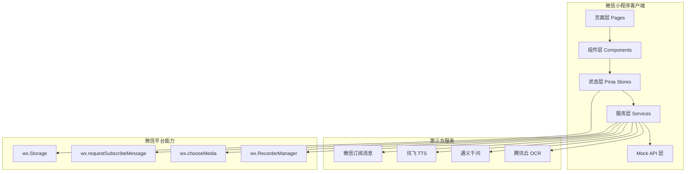
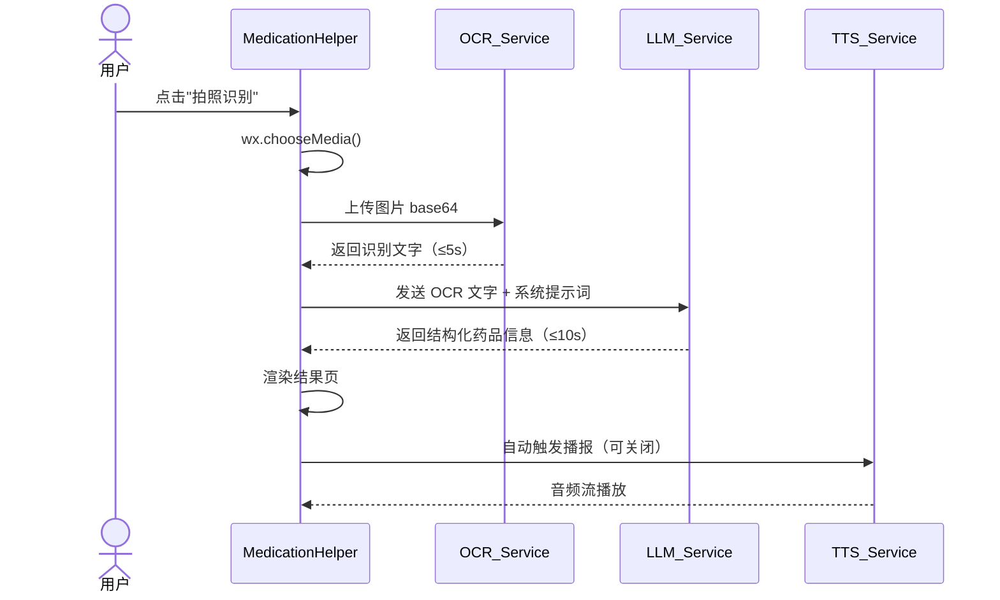
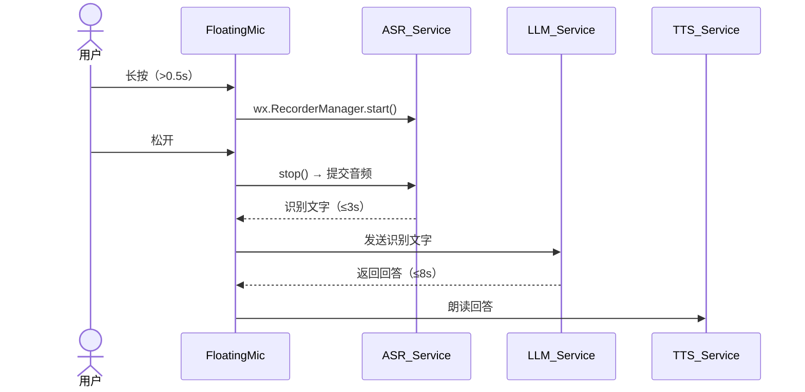
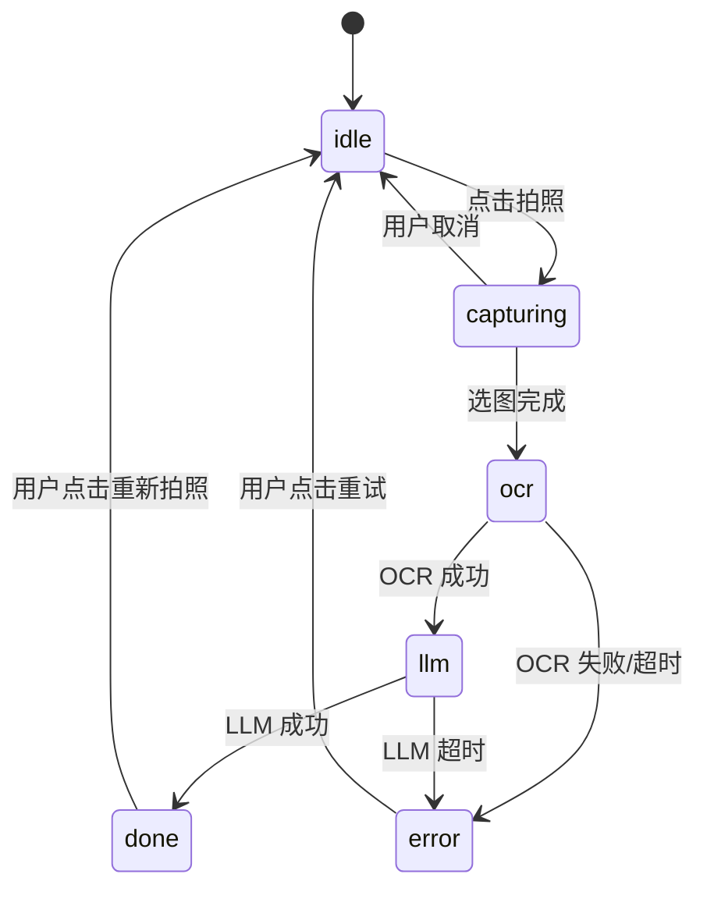

# 技术设计文档：银龄 AI 助手

## 概述

银龄 AI 助手是一款面向中老年用户的微信小程序，基于 uni-app + Vue3 + TypeScript 开发。MVP 阶段聚焦三大核心功能：**AI 问药**、**语音助手**、**健康提醒**。

### 设计原则

- **语音优先**：所有核心操作均可通过语音完成，文字输入作为备选
- **适老化**：88×88pt 最小触摸区域、18pt 正文字体、高对比度配色
- **离线降级**：网络不可用时提供本地缓存兜底，不直接崩溃
- **平台约束优先**：严格遵守微信小程序限制（无 DOM、无 Web Speech API、包体积 ≤2MB 主包）

### 技术栈

| 层次 | 技术选型 |
|------|---------|
| 框架 | uni-app + Vue3 + TypeScript + Composition API |
| 样式 | UnoCSS（uni-app 版） |
| 状态管理 | Pinia |
| 语音识别 | 微信小程序内置 `wx.startRecord` + `RecorderManager` |
| 语音合成 | 讯飞 WebSocket TTS API |
| OCR | 腾讯云 OCR（通用文字识别） |
| 大模型 | 通义千问 API（qwen-turbo） |
| 推送 | 微信订阅消息 |
| 本地存储 | `wx.setStorageSync` / `wx.getStorageSync` |
| MVP 后端 | Mock API（本地 JSON + 延迟模拟） |

---

## 架构

### 整体架构图



### 页面路由结构

```
pages/
├── index/index          # 首页（功能入口）
├── medication/index     # AI 问药主页
├── medication/result    # 药品解析结果页
├── voice/index          # 语音助手对话页
└── reminder/
    ├── index            # 提醒列表页
    ├── create           # 创建提醒页
    └── detail           # 提醒详情页
```

### 分层职责

```
src/
├── pages/               # 页面（路由入口，薄层，只做布局）
├── components/          # 通用 UI 组件
│   └── FloatingMic.vue  # 全局悬浮麦克风
├── stores/              # Pinia 状态管理
│   ├── medication.ts
│   ├── voice.ts
│   └── reminder.ts
├── services/            # 外部服务封装
│   ├── ocr.ts
│   ├── llm.ts
│   ├── tts.ts
│   ├── asr.ts
│   └── push.ts
├── mock/                # Mock API 数据与延迟模拟
├── composables/         # 可复用逻辑（useVoice, useReminder 等）
├── utils/               # 工具函数
└── types/               # TypeScript 类型定义
```

---

## 组件与接口

### 核心组件

#### FloatingMic（全局悬浮麦克风）

全局注册在 App.vue，通过 `position: fixed` 固定在右下角。

```typescript
// 组件 Props
interface FloatingMicProps {
  hidden?: boolean  // 相机调用期间隐藏
}

// 组件 Emits
interface FloatingMicEmits {
  (e: 'recordStart'): void
  (e: 'recordEnd', audioPath: string): void
  (e: 'recordTooShort'): void  // 按住 < 0.5s
}
```

长按逻辑：使用 `@touchstart` + `@touchend` 配合计时器，超过 500ms 才触发录音。

#### MedicationHelper 页面流程



#### VoiceAssistant 对话流程



### 服务接口定义

```typescript
// OCR 服务
interface OcrService {
  recognize(imageBase64: string): Promise<OcrResult>
}
interface OcrResult {
  text: string
  confidence: number  // 0-1
  success: boolean
}

// LLM 服务
interface LlmService {
  parseMedication(ocrText: string): Promise<MedicationInfo>
  chat(messages: ChatMessage[]): Promise<string>
}

// TTS 服务
interface TtsService {
  speak(text: string, speed?: number): Promise<void>  // speed 默认 0.8
  stop(): void
  readonly isPlaying: boolean
}

// ASR 服务（封装微信 RecorderManager）
interface AsrService {
  startRecording(): void
  stopRecording(): Promise<AsrResult>
}
interface AsrResult {
  text: string
  confidence: number
  success: boolean
}

// 提醒服务
interface ReminderService {
  create(reminder: CreateReminderDto): Promise<Reminder>
  list(): Reminder[]
  complete(id: string): void
  snooze(id: string, minutes: number): void
  delete(id: string): void
}
```

### Pinia Store 接口

```typescript
// stores/medication.ts
interface MedicationStore {
  status: 'idle' | 'capturing' | 'ocr' | 'llm' | 'done' | 'error'
  ocrText: string
  medicationInfo: MedicationInfo | null
  errorMessage: string
  // actions
  startCapture(): Promise<void>
  retry(): void
  speakResult(): void
}

// stores/voice.ts
interface VoiceStore {
  isRecording: boolean
  isProcessing: boolean
  messages: ChatMessage[]  // 最近 10 条
  // actions
  startRecord(): void
  stopRecord(): Promise<void>
}

// stores/reminder.ts
interface ReminderStore {
  reminders: Reminder[]
  // actions
  createReminder(dto: CreateReminderDto): Promise<void>
  toggleReminder(id: string): void
  completeReminder(id: string): void
  snoozeReminder(id: string): void
}
```

---

## 数据模型

### MedicationInfo

```typescript
interface MedicationInfo {
  name: string           // 药品名称
  indications: string    // 适应症
  dosage: string         // 用法用量
  contraindications: string  // 禁忌事项
  isPrescription: boolean    // 是否处方药
  rawText: string        // OCR 原始文字（用于重试）
  createdAt: number      // 时间戳
}
```

### Reminder

```typescript
interface Reminder {
  id: string
  name: string           // 提醒名称
  time: string           // HH:mm 格式
  repeatType: 'once' | 'daily' | 'weekly' | 'custom'
  repeatDays?: number[]  // 0-6，周日到周六（custom 时使用）
  note?: string          // 备注
  enabled: boolean       // 启用/停用
  subscribed: boolean    // 是否已授权微信订阅消息
  createdAt: number
  completions: ReminderCompletion[]  // 最近 30 天完成记录
}

interface ReminderCompletion {
  scheduledAt: number    // 计划触发时间
  completedAt: number    // 实际完成时间
  status: 'completed' | 'snoozed' | 'missed'
}
```

### ChatMessage

```typescript
interface ChatMessage {
  id: string
  role: 'user' | 'assistant'
  content: string
  timestamp: number
}
```

### 本地存储 Key 规范

| Key | 类型 | 说明 |
|-----|------|------|
| `silver_reminders` | `Reminder[]` | 所有提醒数据 |
| `silver_med_history` | `MedicationInfo[]` | 最近 10 次问药记录 |
| `silver_chat_history` | `ChatMessage[]` | 最近 10 条对话 |
| `silver_settings` | `AppSettings` | 用户设置（自动播报开关等） |
| `silver_subscription` | `boolean` | 是否已授权订阅消息 |

### AppSettings

```typescript
interface AppSettings {
  autoSpeak: boolean      // 进入结果页自动播报，默认 true
  ttsSpeed: number        // TTS 速度，默认 0.8
  fontSize: 'normal' | 'large' | 'xlarge'  // 字体档位
}
```

---

## 正确性属性

*属性（Property）是在系统所有有效执行中都应成立的特征或行为——本质上是对系统应做什么的形式化陈述。属性是人类可读规范与机器可验证正确性保证之间的桥梁。*

### 属性 1：字体大小不低于最小值

*对于任意*页面中的正文文本节点，其字体大小应不小于 18pt（约 24px）；对于标题文本节点，其字体大小应不小于 32pt（约 43px）。

**验证需求：1.1、1.2、7.2**

---

### 属性 2：按钮触摸区域不小于 88×88pt

*对于任意*可交互按钮组件（包括 FloatingMic、详情页操作按钮），其 `min-width` 和 `min-height` 样式值均应不小于 88pt（约 117px）。

**验证需求：1.3、5.1、9.2**

---

### 属性 3：TTS 调用速度参数始终为 0.8

*对于任意*触发语音播报的场景（AI 问药结果播报、语音助手回答播报），TTS 服务被调用时传入的 `speed` 参数应等于 0.8。

**验证需求：1.5、4.1、6.3**

---

### 属性 4：低质量识别结果触发错误提示

*对于任意* OCR 或 ASR 识别结果，若 `success` 为 false 或 `confidence` 低于阈值（OCR < 0.6，ASR < 0.5），系统应显示对应的错误提示文案，且不继续调用下游服务（LLM）。

**验证需求：2.3、6.5**

---

### 属性 5：OCR 成功后 LLM 被调用且参数包含 OCR 文字

*对于任意*成功的 OCR 识别结果（`success=true`，`confidence ≥ 0.6`），LLM 服务应被调用一次，且调用参数中包含完整的 OCR 识别文字。

**验证需求：2.6**

---

### 属性 6：识别过程中按钮被禁用

*对于任意*正在进行 OCR 或 LLM 处理的状态（`status` 为 `'ocr'` 或 `'llm'`），"拍照识别"按钮应处于禁用状态，防止重复提交。

**验证需求：2.5**

---

### 属性 7：LLM 药品解析结果包含四项核心字段

*对于任意*传入 LLM 的 OCR 文字，解析返回的 `MedicationInfo` 对象应包含 `name`、`indications`、`dosage`、`contraindications` 四个非空字段。

**验证需求：3.1**

---

### 属性 8：LLM 输出字数约束

*对于任意*输入，LLM 药品解析结果的总字数应不超过 200 字；语音助手回答的字数应不超过 150 字。

**验证需求：3.2、6.2**

---

### 属性 9：处方药标识触发警示文案

*对于任意* `isPrescription=true` 的 `MedicationInfo`，结果页渲染后应包含"请遵医嘱，勿自行用药"警示文案；`isPrescription=false` 时不应显示该文案。

**验证需求：3.5**

---

### 属性 10：自动播报受设置控制

*对于任意*进入药品解析结果页的场景，若 `AppSettings.autoSpeak=true`，TTS 服务应被自动调用一次；若 `autoSpeak=false`，TTS 服务不应被自动调用。

**验证需求：4.5**

---

### 属性 11：TTS 播放状态与 UI 同步

*对于任意* TTS 播放状态变化，当 `isPlaying=true` 时 UI 应显示"停止播报"按钮；调用 `stop()` 后 `isPlaying` 应变为 `false`，UI 恢复"语音播报"按钮。

**验证需求：4.2、4.3**

---

### 属性 12：长按时间阈值控制录音触发

*对于任意*按压时长，超过 500ms 的按压应触发录音状态（`isRecording=true`）；不足 500ms 的按压不应触发录音，应显示"请长按说话"提示。

**验证需求：5.3、5.5（边缘情况）**

---

### 属性 13：相机调用期间 FloatingMic 隐藏

*对于任意*相机调用状态，当 `wx.chooseMedia` 被调用时 FloatingMic 的 `hidden` 属性应为 `true`；相机关闭后 `hidden` 应恢复为 `false`。

**验证需求：5.6**

---

### 属性 14：对话历史最多保留 10 条

*对于任意*对话操作序列，无论发送多少条消息，`VoiceStore.messages` 数组长度应始终不超过 10，超出时移除最旧的记录。

**验证需求：6.4**

---

### 属性 15：提醒意图触发路由跳转

*对于任意*包含"设置提醒"、"提醒我"等意图关键词的 LLM 响应，系统应触发跳转至 HealthReminder 创建页面的路由操作。

**验证需求：6.7**

---

### 属性 16：过去时间的提醒被拒绝

*对于任意*提醒创建请求，若提醒时间早于当前时间，`Reminder_Service.create()` 应抛出验证错误，且提醒不应被持久化存储。

**验证需求：7.3、7.4**

---

### 属性 17：提醒数据持久化 Round Trip

*对于任意*合法的提醒数据，调用 `create()` 后再调用 `list()`，应能读取到与创建时相同的提醒内容（id、name、time、repeatType 字段一致）。

**验证需求：7.5**

---

### 属性 18：重复提醒每次触发前重新申请订阅权限

*对于任意*已启用的重复提醒，每次触发前系统应调用 `wx.requestSubscribeMessage`，且调用次数等于触发次数。

**验证需求：8.5**

---

### 属性 19：完成操作记录时间戳并更新状态

*对于任意*提醒，调用 `completeReminder(id)` 后，该提醒的最新 `completion` 记录应包含 `completedAt` 时间戳且 `status` 为 `'completed'`。

**验证需求：9.3**

---

### 属性 20：Snooze 操作设置正确的下次触发时间

*对于任意*提醒，调用 `snoozeReminder(id)` 后，下次触发时间应等于当前时间加 15 分钟（误差 ≤ 1 秒）。

**验证需求：9.4**

---

### 属性 21：30 天外的完成记录被清理

*对于任意*提醒，其 `completions` 数组中不应包含 `completedAt` 早于当前时间 30 天前的记录。

**验证需求：9.6**

---

## 错误处理

### 错误分类与处理策略

| 错误类型 | 触发场景 | 处理策略 | 用户提示 |
|---------|---------|---------|---------|
| 网络不可用 | 任意 API 调用前 | 检测网络状态，提前拦截 | "当前网络不可用，请检查网络后重试" |
| OCR 识别失败 | 置信度低/返回空 | 允许重试，不调用 LLM | "识别失败，请重新拍摄清晰图片" |
| OCR 超时（>5s） | 网络慢/服务异常 | 取消请求，显示重试 | "识别超时，请重试" |
| LLM 解析超时（>10s） | 服务繁忙 | 取消请求，保留 OCR 文字 | "AI 解析超时，请稍后重试" |
| LLM 回答超时（>8s） | 服务繁忙 | 显示等待提示，继续等待 | "AI 思考中，请稍候" |
| ASR 识别失败 | 置信度低/静音 | 提示重新录音 | "没有听清，请再说一遍" |
| TTS 调用失败 | 讯飞服务异常 | 降级为纯文字展示 | "语音播报暂不可用，请阅读文字内容" |
| 订阅消息拒绝 | 用户拒绝授权 | 继续保存提醒，仅小程序内提醒 | "未授权将无法收到微信通知，提醒仍会在小程序内显示" |
| 提醒时间无效 | 时间早于当前 | 阻止提交，高亮时间字段 | "提醒时间不能早于当前时间" |

### 错误状态机（以 MedicationHelper 为例）



### 全局错误边界

在 `App.vue` 中通过 `onError` 捕获未处理异常，上报到日志服务（MVP 阶段仅 `console.error`），避免白屏。

---

## 测试策略

### 双轨测试方法

本项目采用**单元测试 + 属性测试**双轨策略：

- **单元测试**：验证具体示例、边缘情况、错误条件
- **属性测试**：验证对所有输入都成立的普遍属性

两者互补，共同保证覆盖率。

### 测试工具选型

| 工具 | 用途 |
|------|------|
| Vitest | 单元测试运行器 |
| fast-check | 属性测试库（TypeScript 原生支持） |
| @vue/test-utils | Vue 组件测试 |
| vi.mock | 微信 API / 第三方服务 Mock |

### 属性测试配置

每个属性测试最少运行 **100 次**随机输入迭代。每个属性测试必须通过注释标注对应的设计文档属性：

```typescript
// Feature: silver-miniprogram, Property 8: LLM 输出字数约束
it('LLM 药品解析结果不超过 200 字', () => {
  fc.assert(
    fc.property(fc.string({ minLength: 10 }), async (ocrText) => {
      const result = await mockLlmService.parseMedication(ocrText)
      const totalChars = [result.name, result.indications, result.dosage, result.contraindications].join('').length
      expect(totalChars).toBeLessThanOrEqual(200)
    }),
    { numRuns: 100 }
  )
})
```

### 单元测试重点

单元测试聚焦以下场景，避免与属性测试重复：

- 具体示例：处方药警示文案的渲染（给定固定 `MedicationInfo`）
- 集成点：FloatingMic 与 VoiceStore 的事件联动
- 边缘情况：网络不可用、OCR 超时、TTS 失败的降级行为
- 路由跳转：通知启动参数解析后跳转到正确页面

### 属性测试覆盖矩阵

| 属性编号 | 属性名称 | 测试类型 | 生成器策略 |
|---------|---------|---------|-----------|
| 属性 1 | 字体大小不低于最小值 | property | 随机文本内容 |
| 属性 2 | 按钮触摸区域不小于 88×88pt | property | 枚举所有按钮组件 |
| 属性 3 | TTS 速度参数始终为 0.8 | property | 随机文本 + 随机触发场景 |
| 属性 4 | 低质量识别结果触发错误提示 | property | 随机置信度（0-1）+ 随机文本 |
| 属性 5 | OCR 成功后 LLM 被调用 | property | 随机 OCR 成功结果 |
| 属性 6 | 处理中按钮被禁用 | property | 随机处理状态 |
| 属性 7 | LLM 解析结果包含四项字段 | property | 随机 OCR 文字 |
| 属性 8 | LLM 输出字数约束 | property | 随机输入文字 |
| 属性 9 | 处方药标识触发警示 | property | 随机 `isPrescription` 布尔值 |
| 属性 10 | 自动播报受设置控制 | property | 随机 `autoSpeak` 布尔值 |
| 属性 11 | TTS 状态与 UI 同步 | property | 随机播放/停止操作序列 |
| 属性 12 | 长按时间阈值 | property | 随机按压时长（0-2000ms） |
| 属性 13 | 相机期间 FloatingMic 隐藏 | property | 随机相机开关序列 |
| 属性 14 | 对话历史最多 10 条 | property | 随机消息数量（1-50） |
| 属性 15 | 提醒意图触发路由 | property | 随机包含/不含意图关键词的文本 |
| 属性 16 | 过去时间提醒被拒绝 | property | 随机时间戳（过去/未来） |
| 属性 17 | 提醒数据持久化 Round Trip | property | 随机合法提醒数据 |
| 属性 18 | 重复提醒重新申请订阅 | property | 随机触发次数（1-10） |
| 属性 19 | 完成操作记录时间戳 | property | 随机提醒 + 随机完成时间 |
| 属性 20 | Snooze 设置正确触发时间 | property | 随机提醒 + 随机当前时间 |
| 属性 21 | 30 天外记录被清理 | property | 随机时间跨度的完成记录 |

### Mock 策略

微信小程序 API 和第三方服务均通过 `vi.mock` 在测试环境中替换：

```typescript
// mock/wx.ts - 微信 API Mock
vi.mock('@/utils/wx', () => ({
  chooseMedia: vi.fn(),
  requestSubscribeMessage: vi.fn(),
  setStorageSync: vi.fn(),
  getStorageSync: vi.fn(() => null),
}))

// mock/services.ts - 第三方服务 Mock
vi.mock('@/services/ocr', () => ({
  recognize: vi.fn()
}))
vi.mock('@/services/llm', () => ({
  parseMedication: vi.fn(),
  chat: vi.fn()
}))
vi.mock('@/services/tts', () => ({
  speak: vi.fn(),
  stop: vi.fn(),
  isPlaying: false
}))
```
