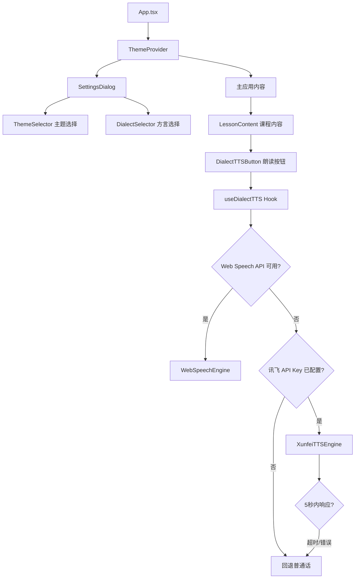
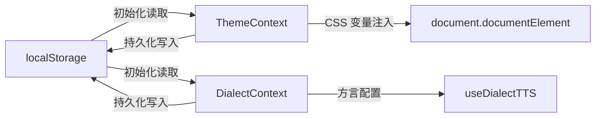
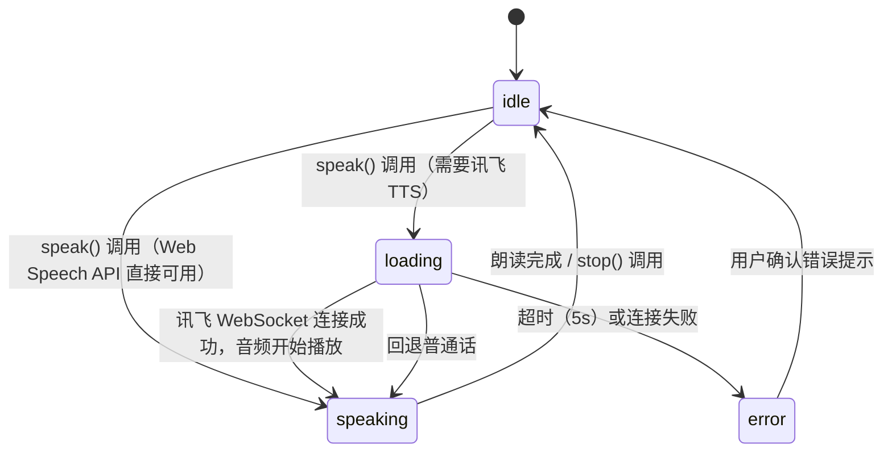

# 技术设计文档：UI 主题切换 & 方言朗读

## 概述

本文档描述"银发 AI 指南"新增两个功能模块的技术设计：

1. **UI 主题系列切换**：提供 4 套预设主题，通过 CSS 变量全局切换，用户偏好持久化至 localStorage。
2. **方言朗读功能**：支持 6 种中文方言，优先使用 Web Speech API，不可用时降级至讯飞 TTS（WebSocket 接口）。

目标用户为 55 岁以上中老年人，所有 UI 组件须满足适老化标准（字号 ≥ 20px，触控区域 ≥ 44×44px，色彩对比度 ≥ 4.5:1）。

---

## 架构

### 整体架构图



### 状态管理架构



### 关键设计决策

| 决策 | 选择 | 理由 |
|------|------|------|
| 主题实现方式 | CSS 变量 + React Context | 无需重新渲染整棵树，切换性能好，与现有 `index.css` 变量体系兼容 |
| 状态管理 | React Context（不引入 Redux） | 功能范围有限，避免过度工程化 |
| TTS 降级策略 | Web Speech API → 讯飞 TTS → 普通话回退 | 优先离线，保证可用性 |
| 讯飞接入方式 | WebSocket（讯飞实时语音合成） | 支持流式音频，延迟低，符合需求 6.2 的 5 秒要求 |
| 设置入口 | Dialog（Radix UI Dialog） | 项目已有 Radix UI，无需额外依赖；不破坏现有页面布局 |

---

## 组件与接口

### 新增文件结构

```
src/
├── contexts/
│   ├── ThemeContext.tsx        # 主题 Context + Provider
│   └── DialectContext.tsx      # 方言 Context + Provider
├── hooks/
│   └── useDialectTTS.ts        # 方言朗读核心 Hook
├── services/
│   └── xunfeiTTS.ts            # 讯飞 TTS WebSocket 封装
├── components/
│   ├── SettingsDialog.tsx      # 设置弹窗（主题 + 方言）
│   ├── ThemeSelector.tsx       # 主题选择卡片列表
│   └── DialectTTSButton.tsx    # 朗读按钮（含状态显示）
└── types/
    └── theme-dialect.ts        # 共享类型定义
```

### ThemeContext 接口

```typescript
interface ThemeContextValue {
  currentTheme: ThemeId;
  setTheme: (id: ThemeId) => void;
  themes: ThemeConfig[];
}

// Provider 在 App 根节点包裹，初始化时从 localStorage 读取
```

### DialectContext 接口

```typescript
interface DialectContextValue {
  currentDialect: DialectId;
  setDialect: (id: DialectId) => void;
  dialects: DialectConfig[];
}
```

### useDialectTTS Hook 接口

```typescript
interface UseDialectTTSReturn {
  status: TTSStatus;           // 'idle' | 'loading' | 'speaking' | 'error'
  statusMessage: string;       // 用户可见的状态文字
  speak: (text: string) => void;
  stop: () => void;
}
```

### XunfeiTTSEngine 接口

```typescript
interface TTSEngine {
  speak(text: string, dialect: DialectConfig): Promise<void>;
  stop(): void;
}

// xunfeiTTS.ts 实现此接口，通过 WebSocket 连接讯飞实时语音合成 API
// API Key 通过 import.meta.env.VITE_XUNFEI_APP_ID 等环境变量注入
```

### SettingsDialog 组件接口

```typescript
interface SettingsDialogProps {
  trigger: React.ReactNode;  // 触发按钮（⚙️ 设置）
}
// 内部使用 Radix UI Dialog，包含 ThemeSelector 和 DialectSelector
```

---

## 数据模型

### 主题配置

```typescript
type ThemeId = 'nature' | 'chinese-classic' | 'modern-clean' | 'ink-wellness';

interface ThemeConfig {
  id: ThemeId;
  name: string;           // 中文名称，如"自然草本风"
  description: string;    // 一句话描述
  colors: {
    primary: string;      // 主色调
    bg: string;           // 背景色
    text: string;         // 文字色
    border: string;       // 边框色
    primaryContrast: string; // 主色调上的文字色
  };
  // CSS 变量映射，直接注入 document.documentElement.style
  cssVars: Record<string, string>;
}

// 四套主题的静态配置数据（src/data/themes.ts）
const THEMES: ThemeConfig[] = [
  {
    id: 'nature',
    name: '自然草本风',
    description: '清新自然，舒缓眼睛',
    colors: { primary: '#4a7c59', bg: '#f5f0e8', text: '#2d2416', border: '#c8dcc0', primaryContrast: '#ffffff' },
    cssVars: {
      '--color-primary': '#4a7c59',
      '--color-bg': '#f5f0e8',
      '--color-text': '#2d2416',
      '--color-border': '#c8dcc0',
      '--color-primary-contrast': '#ffffff',
    }
  },
  {
    id: 'chinese-classic',
    name: '中华传统风',
    description: '古典雅致，文化底蕴',
    colors: { primary: '#c0392b', bg: '#fdf6ec', text: '#1a0a00', border: '#d4a853', primaryContrast: '#ffffff' },
    cssVars: {
      '--color-primary': '#c0392b',
      '--color-bg': '#fdf6ec',
      '--color-text': '#1a0a00',
      '--color-border': '#d4a853',
      '--color-primary-contrast': '#ffffff',
    }
  },
  {
    id: 'modern-clean',
    name: '现代简约风',
    description: '简洁明快，清晰易读',
    colors: { primary: '#0891b2', bg: '#ffffff', text: '#1a1a1a', border: '#d1d5db', primaryContrast: '#ffffff' },
    cssVars: {
      '--color-primary': '#0891b2',
      '--color-bg': '#ffffff',
      '--color-text': '#1a1a1a',
      '--color-border': '#d1d5db',
      '--color-primary-contrast': '#ffffff',
    }
  },
  {
    id: 'ink-wellness',
    name: '水墨养生风',
    description: '沉稳内敛，养眼护目',
    colors: { primary: '#2c3e50', bg: '#f4ede0', text: '#2c1810', border: '#c9b99a', primaryContrast: '#ffffff' },
    cssVars: {
      '--color-primary': '#2c3e50',
      '--color-bg': '#f4ede0',
      '--color-text': '#2c1810',
      '--color-border': '#c9b99a',
      '--color-primary-contrast': '#ffffff',
    }
  },
];
```

### 方言配置

```typescript
type DialectId = 'mandarin' | 'cantonese' | 'hokkien' | 'sichuan' | 'shanghainese' | 'northeastern';

interface DialectConfig {
  id: DialectId;
  name: string;           // 显示名称，如"粤语（广东话）"
  webSpeechLangs: string[]; // 优先尝试的 Web Speech API lang 代码列表
  xunfeiVcn?: string;     // 讯飞发音人代码（如 'x_xiaomei' 粤语）
  fallbackToMandarin: boolean; // 无法朗读时是否回退普通话
}

const DIALECTS: DialectConfig[] = [
  { id: 'mandarin',     name: '普通话',          webSpeechLangs: ['zh-CN'],        xunfeiVcn: undefined,    fallbackToMandarin: false },
  { id: 'cantonese',    name: '粤语（广东话）',   webSpeechLangs: ['zh-HK', 'yue'], xunfeiVcn: 'x_xiaomei', fallbackToMandarin: true  },
  { id: 'hokkien',      name: '闽南语（台湾话）', webSpeechLangs: ['zh-TW'],        xunfeiVcn: 'x_hokkien', fallbackToMandarin: true  },
  { id: 'sichuan',      name: '四川话',           webSpeechLangs: [],               xunfeiVcn: 'x_sichuan', fallbackToMandarin: true  },
  { id: 'shanghainese', name: '上海话',           webSpeechLangs: [],               xunfeiVcn: 'x_shanghai',fallbackToMandarin: true  },
  { id: 'northeastern', name: '东北话',           webSpeechLangs: [],               xunfeiVcn: 'x_dongbei', fallbackToMandarin: true  },
];
```

### localStorage 键值

| 键名 | 类型 | 默认值 | 说明 |
|------|------|--------|------|
| `silver-ai-theme` | `ThemeId` | `'modern-clean'` | 用户选择的主题标识符 |
| `silver-ai-dialect` | `DialectId` | `'mandarin'` | 用户选择的方言标识符 |

### TTS 状态机



### 讯飞 TTS WebSocket 鉴权

讯飞实时语音合成使用 HMAC-SHA256 签名鉴权，所需环境变量：

```
VITE_XUNFEI_APP_ID=your_app_id
VITE_XUNFEI_API_KEY=your_api_key
VITE_XUNFEI_API_SECRET=your_api_secret
```

鉴权 URL 在客户端通过时间戳 + HMAC-SHA256 动态生成（注意：前端直接调用讯飞 WebSocket 需在讯飞控制台配置允许的域名白名单）。

---

## 正确性属性

*属性（Property）是在系统所有有效执行中都应成立的特征或行为——本质上是对系统应做什么的形式化陈述。属性是人类可读规范与机器可验证正确性保证之间的桥梁。*

### 属性 1：主题配置完整性

*对任意*主题配置对象，它都应包含非空的 `id`、`name`、`description` 字段，以及包含 `primary`、`bg`、`text`、`border` 四个颜色值的 `colors` 对象，且所有颜色值均为有效的十六进制颜色字符串。

**验证需求：1.2**

---

### 属性 2：主题颜色对比度

*对任意*主题配置，其 `text` 颜色与 `bg` 颜色之间的 WCAG 对比度应不低于 4.5:1（AA 标准）。

**验证需求：1.3**

---

### 属性 3：主题切换后 CSS 变量正确更新

*对任意*有效的主题 id，调用 `setTheme(id)` 后，`document.documentElement` 上的 CSS 变量（`--color-primary`、`--color-bg`、`--color-text`、`--color-border`）应与该主题配置中的 `cssVars` 完全一致。

**验证需求：2.2, 2.5**

---

### 属性 4：主题选中标记唯一性

*对任意*主题 id，当该主题被选中后，设置页面中只有该主题卡片显示选中标记，其余所有主题卡片均不显示选中标记。

**验证需求：2.3**

---

### 属性 5：偏好设置持久化 round-trip

*对任意*有效的主题 id，调用 `setTheme(id)` 后，`localStorage.getItem('silver-ai-theme')` 的返回值应等于该 id；*对任意*有效的方言 id，调用 `setDialect(id)` 后，`localStorage.getItem('silver-ai-dialect')` 的返回值应等于该 id。

**验证需求：3.1, 4.3**

---

### 属性 6：偏好设置初始化读取

*对任意*存储在 `localStorage` 中的有效主题 id，ThemeContext 初始化后 `currentTheme` 应等于该 id；*对任意*存储在 `localStorage` 中的有效方言 id，DialectContext 初始化后 `currentDialect` 应等于该 id。

**验证需求：3.2, 4.4**

---

### 属性 7：方言配置完整性

*对任意*方言配置对象，它都应包含非空的 `id`、`name` 字段，且 `name` 字段应包含中文字符；`webSpeechLangs` 字段应为数组（可为空）；`fallbackToMandarin` 字段应为布尔值。

**验证需求：4.2**

---

### 属性 8：Web Speech API 降级触发

*对任意*方言配置，当 Web Speech API 对该方言的所有 `webSpeechLangs` 均不可用时，`useDialectTTS` 应尝试调用讯飞 TTS 引擎（若 API Key 已配置）；若讯飞 TTS 也不可用，则最终使用普通话（`zh-CN`）朗读。

**验证需求：5.5, 5.6**

---

### 属性 9：TTS 错误处理

*对任意*讯飞 TTS 调用，若服务在 5 秒内未响应或返回错误，`useDialectTTS` 的 `status` 应变为 `'error'`，`statusMessage` 应包含用户可读的错误提示文字，且朗读流程应停止。

**验证需求：6.2, 6.3**

---

### 属性 10：TTS 状态正确反映

*对任意*朗读调用，在讯飞 TTS 响应前 `status` 应为 `'loading'`；朗读进行中 `status` 应为 `'speaking'`，且 `statusMessage` 应包含当前方言的中文名称；朗读结束后 `status` 应回到 `'idle'`。

**验证需求：6.4, 7.1**

---

### 属性 11：停止朗读立即生效

*对任意*朗读状态（`'loading'` 或 `'speaking'`），调用 `stop()` 后，`status` 应立即变为 `'idle'`。

**验证需求：7.2**

---

### 属性 12：语速不超过正常语速的 80%

*对任意*使用 Web Speech API 的朗读调用，`SpeechSynthesisUtterance` 的 `rate` 属性值应不大于 0.8。

**验证需求：7.5**

---

### 属性 13：关闭设置页面不丢失应用状态

*对任意*应用状态（当前选中课程 id），打开设置页面再关闭后，应用的 `activeId` 状态应与打开前完全一致。

**验证需求：8.5**

---

## 错误处理

### 主题系统错误处理

| 场景 | 处理方式 |
|------|----------|
| localStorage 读取失败（如隐私模式） | 捕获异常，使用默认主题 `modern-clean`，不抛出错误 |
| localStorage 中主题值无效（不在枚举中） | 忽略无效值，使用默认主题 `modern-clean` |
| CSS 变量注入失败 | 静默失败，保持当前样式不变 |

### 方言朗读错误处理

| 场景 | 处理方式 |
|------|----------|
| Web Speech API 不可用（浏览器不支持） | 直接跳过，尝试讯飞 TTS |
| 讯飞 API Key 未配置 | 跳过讯飞 TTS，回退普通话，不抛出异常 |
| 讯飞 WebSocket 连接超时（>5s） | 设置 status='error'，显示"语音服务暂时不可用，请稍后重试" |
| 讯飞 WebSocket 返回错误码 | 同上 |
| 所有方言均不可用 | 回退普通话，显示"当前方言暂不可用，已切换为普通话朗读" |
| 组件卸载时朗读仍在进行 | useEffect cleanup 中调用 stop()，防止内存泄漏 |

### 错误提示设计原则

- 所有错误提示使用中文，语言简洁，适合中老年用户理解
- 错误提示通过 `statusMessage` 字段传递，由 `DialectTTSButton` 组件展示
- 不使用技术术语（如"WebSocket 连接失败"），改用"语音服务暂时不可用"

---

## 测试策略

### 双轨测试方法

本功能采用单元测试 + 属性测试的双轨策略：

- **单元测试**：验证具体示例、边界条件和错误场景
- **属性测试**：验证对所有有效输入都成立的普遍性质

两者互补，共同保证功能正确性。

### 测试框架

- **单元测试 / 属性测试**：Vitest（项目已有）
- **属性测试库**：`fast-check`（TypeScript 友好，与 Vitest 集成良好）
- **组件测试**：`@testing-library/react`（项目已有）

安装：
```bash
npm install --save-dev fast-check
```

### 单元测试覆盖点

```
src/test/
├── theme/
│   ├── themeConfig.test.ts      # 主题配置数据验证（示例测试）
│   ├── ThemeContext.test.tsx    # Context 初始化、切换、持久化
│   └── ThemeSelector.test.tsx  # 主题卡片渲染、选中标记
├── dialect/
│   ├── dialectConfig.test.ts   # 方言配置数据验证（示例测试）
│   ├── DialectContext.test.tsx  # Context 初始化、切换、持久化
│   ├── useDialectTTS.test.ts   # TTS Hook 状态机、降级逻辑
│   └── xunfeiTTS.test.ts       # 讯飞 TTS 超时、错误处理
└── settings/
    └── SettingsDialog.test.tsx  # 设置页面打开/关闭、状态保持
```

**单元测试重点（具体示例和边界条件）**：
- 四套主题配置数据完整性（示例）
- 六种方言配置数据完整性（示例）
- localStorage 无记录时默认 `modern-clean`（边界）
- localStorage 无记录时默认 `mandarin`（边界）
- localStorage 值无效时回退默认值（边界）
- 讯飞 API Key 未配置时不调用讯飞服务（边界）
- 所有方言均不可用时回退普通话（边界）
- 普通话朗读使用 `zh-CN` lang 代码（示例）

### 属性测试覆盖点

每个属性测试最少运行 100 次迭代。每个测试用注释标注对应的设计属性。

```typescript
// 示例：属性 2 - 主题颜色对比度
// Feature: theme-dialect, Property 2: 主题颜色对比度不低于 WCAG AA 4.5:1
it.prop([fc.constantFrom(...THEMES)])('所有主题颜色对比度满足 WCAG AA', (theme) => {
  const ratio = calculateContrastRatio(theme.colors.text, theme.colors.bg);
  expect(ratio).toBeGreaterThanOrEqual(4.5);
});
```

**属性测试标注格式**：
```
Feature: theme-dialect, Property {编号}: {属性描述}
```

| 属性编号 | 测试文件 | 生成器策略 |
|----------|----------|------------|
| 属性 1 | themeConfig.test.ts | `fc.constantFrom(...THEMES)` |
| 属性 2 | themeConfig.test.ts | `fc.constantFrom(...THEMES)` |
| 属性 3 | ThemeContext.test.tsx | `fc.constantFrom(...THEME_IDS)` |
| 属性 4 | ThemeSelector.test.tsx | `fc.constantFrom(...THEME_IDS)` |
| 属性 5 | ThemeContext.test.tsx + DialectContext.test.tsx | `fc.constantFrom(...)` |
| 属性 6 | ThemeContext.test.tsx + DialectContext.test.tsx | `fc.constantFrom(...)` |
| 属性 7 | dialectConfig.test.ts | `fc.constantFrom(...DIALECTS)` |
| 属性 8 | useDialectTTS.test.ts | `fc.constantFrom(...DIALECTS)` + mock |
| 属性 9 | useDialectTTS.test.ts | `fc.integer({min: 5001, max: 30000})` 模拟超时 |
| 属性 10 | useDialectTTS.test.ts | `fc.constantFrom(...DIALECTS)` |
| 属性 11 | useDialectTTS.test.ts | `fc.constantFrom('loading', 'speaking')` |
| 属性 12 | useDialectTTS.test.ts | `fc.constantFrom(...DIALECTS)` |
| 属性 13 | SettingsDialog.test.tsx | `fc.constantFrom(...LESSON_IDS)` |
